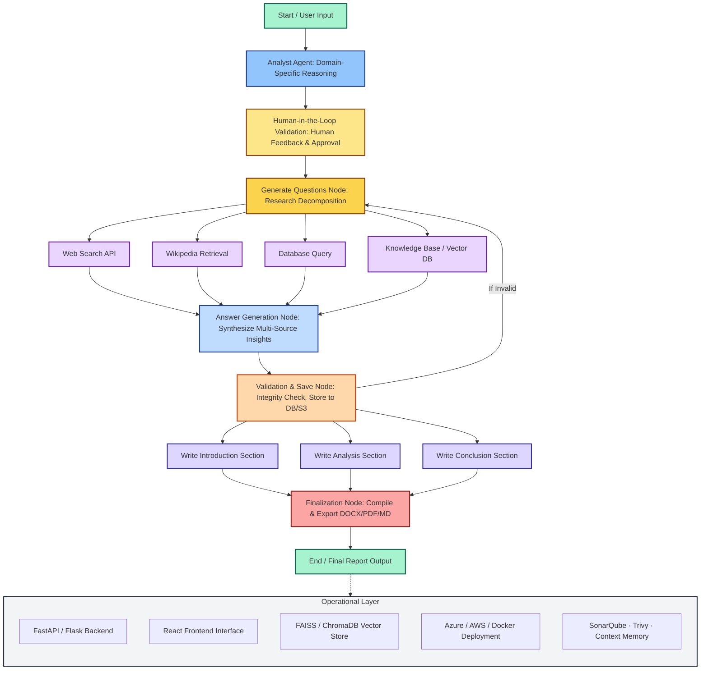


# 🧠 Automated Research and Report Generation System (ARRGS)

## 🚀 Project Overview
The **Automated Research and Report Generation System (ARRGS)** is an AI-powered, multi-agent architecture that automates **research, analysis, and report generation** across multiple domains such as **pharma, finance, academia, and media**.  
The system is built using **LangGraph**, **FastAPI**, **React**, and modern **LLMOps practices** — orchestrating LLM agents, human validation, retrieval workflows, and final report generation.

---

## 🧩 System Architecture

Below is the detailed architecture diagram represented in **Mermaid**, showing how various components of ARRGS interact through the research and generation workflow.

---

---
## 🎯 Objective
To create a **fully automated, domain-agnostic research assistant** that can perform data retrieval, synthesis, and report generation while maintaining accuracy and interpretability via **human-in-the-loop validation**.

---
## ⚙️ Core Workflow

1. **Start Node:** Accepts a topic or research prompt.  
2. **Analyst Agent:** Decomposes the research objective and defines sub-tasks.  
3. **Human Validation:** A human can review or refine generated questions.  
4. **Subgraph (Question Generation):** Produces domain-relevant queries.  
5. **Retrieval Nodes:** Collect information from web, Wikipedia, databases, and vector stores.  
6. **Answer Generation:** Synthesizes insights into structured responses.  
7. **Validation Node:** Checks factual consistency, stores valid data, loops invalid data.  
8. **Report Generation:** Produces structured sections — Introduction, Analysis, Conclusion.  
9. **Finalization Node:** Compiles outputs into a unified report.  
10. **End Node:** Exports reports in `.pdf`, `.docx`, or `.md` format.

---

## 🧠 Key Components

| Component | Description |
|------------|--------------|
| **Analyst Agent** | Domain-specific reasoning (Pharma, Finance, Academic, etc.) |
| **Human-in-the-Loop** | Ensures factual accuracy and ethical oversight |
| **Subgraph** | Handles question generation, retrieval orchestration, and sub-agent flow |
| **Retrieval Tools** | Integrates Web, Wiki, DB, and Knowledge Base APIs |
| **Validation Node** | Verifies answers and re-triggers research loop if needed |
| **Report Writing Nodes** | Compose Introduction, Analysis, and Conclusion sections |
| **Finalization Node** | Merges all sections and exports final report |
| **Ops Layer** | Provides CI/CD, security, and deployment infrastructure |

---

## 🧱 Technologies Used

| Category | Tools / Frameworks |
|-----------|-------------------|
| **LLM Framework** | LangGraph, LangChain, AutoGen, Hugging Face |
| **Backend** | FastAPI / Flask |
| **Frontend** | React + Tailwind + ShadCN/UI |
| **Vector DB** | FAISS / ChromaDB |
| **Storage** | AWS S3 / MongoDB |
| **Deployment** | Docker, Azure, AWS EKS |
| **LLMOps Tools** | SonarQube, Trivy, Context Memory |
| **Version Control** | Git & GitHub Actions |

---

## 🧩 Example Use Cases

### 🧬 Pharmaceutical Research
**Objective:** Accelerate drug discovery and regulatory compliance processes through automated research synthesis.

**Key Applications:**
- **Drug Discovery Documentation:** Automatically compile comprehensive literature reviews on molecular targets, mechanism of action studies, and preclinical efficacy data from PubMed, clinical trial databases, and pharmaceutical journals.
- **Clinical Trial Summaries:** Generate structured summaries of ongoing and completed trials, including patient demographics, endpoints, adverse events, and statistical outcomes.
- **Pipeline Reports:** Create periodic reports tracking drug candidates through development stages (preclinical, Phase I/II/III), monitoring competitive landscape and regulatory milestones.
- **Safety & Pharmacovigilance:** Synthesize adverse event reports, drug interaction studies, and post-market surveillance data into actionable safety profiles.

**Example Workflow:**
1. User inputs: "Generate a comprehensive report on CRISPR-based gene therapies for sickle cell disease"
2. System retrieves data from PubMed, ClinicalTrials.gov, FDA databases, and scientific journals
3. Analyst agent structures information into: mechanism, clinical evidence, safety profile, regulatory status
4. Human validation ensures medical accuracy
5. Final report exported as PDF with citations and evidence tables

---

### 💹 Financial Analytics
**Objective:** Provide data-driven investment insights and risk assessments through multi-source financial analysis.

**Key Applications:**
- **Market Risk Profiles:** Aggregate macroeconomic indicators, sector performance metrics, volatility indices, and geopolitical events to assess portfolio risk exposure.
- **Equity Research Reports:** Analyze company financials, earnings calls, SEC filings, analyst ratings, and news sentiment to generate buy/sell/hold recommendations.
- **Economic Forecasts:** Synthesize central bank reports, inflation data, employment statistics, and leading indicators into forward-looking economic projections.
- **ESG Analysis:** Compile environmental, social, and governance metrics from sustainability reports, third-party ratings, and regulatory disclosures.
- **Competitor Analysis:** Compare financial performance, market positioning, and strategic initiatives across industry peers.

**Example Workflow:**
1. User inputs: "Analyze Tesla's Q4 2024 performance and generate investment recommendation"
2. System retrieves SEC filings, earnings transcripts, analyst reports, stock price data, and industry news
3. Answer generation synthesizes: revenue growth, profitability trends, competitive position, risks
4. Validation ensures numerical accuracy and citation integrity
5. Final report includes financial tables, charts, and actionable insights

---

### 🎓 Academia
**Objective:** Streamline academic research workflows through automated literature synthesis and analysis.

**Key Applications:**
- **Systematic Literature Reviews:** Conduct PRISMA-compliant systematic reviews by searching multiple academic databases (PubMed, IEEE, arXiv, Google Scholar), screening papers based on inclusion criteria, and synthesizing findings.
- **Research Paper Drafting:** Generate structured academic papers with Introduction, Literature Review, Methodology, Results, Discussion, and Conclusion sections based on research data and domain knowledge.
- **Meta-Analysis Support:** Aggregate quantitative results from multiple studies, identify effect sizes, assess publication bias, and generate forest plots.
- **Grant Proposal Research:** Compile background literature, identify research gaps, and synthesize preliminary data to support funding applications.
- **Citation Network Analysis:** Map research lineage, identify seminal papers, and track concept evolution across publications.

**Example Workflow:**
1. User inputs: "Conduct a systematic review on machine learning applications in climate modeling"
2. System searches academic databases with Boolean queries
3. Retrieval nodes collect 200+ relevant papers
4. Analyst agent categorizes by: ML technique, climate domain, datasets used, performance metrics
5. Human validates paper selection and categorization
6. Report generation produces: PRISMA flowchart, summary tables, trend analysis, research gaps
7. Final output exported as LaTeX manuscript with BibTeX references

---

### 📰 Journalism
**Objective:** Enable fact-based, investigative journalism through automated research and source verification.

**Key Applications:**
- **Investigative Research:** Cross-reference public records, court documents, corporate filings, and news archives to uncover stories and verify claims.
- **Fact-Checking:** Validate statements from public figures by retrieving primary sources, statistical databases, and expert commentary.
- **Interview Preparation:** Generate comprehensive background briefs on interview subjects, including biography, recent activities, public statements, and controversy timelines.
- **Data Journalism:** Analyze government datasets, economic indicators, and social statistics to identify newsworthy trends and patterns.
- **Source Attribution:** Maintain rigorous source tracking with hyperlinked citations to ensure journalistic integrity and reader verification.
- **Breaking News Summaries:** Rapidly synthesize developing stories from multiple wire services, social media, and official statements.

**Example Workflow:**
1. User inputs: "Prepare an investigative brief on recent changes in state education funding"
2. System retrieves: state budget documents, legislative records, education department reports, news coverage
3. Question generation creates sub-queries: funding trends, policy changes, impact analysis, stakeholder positions
4. Answer synthesis compiles: historical context, current developments, expert opinions, affected communities
5. Human journalist reviews for balance, newsworthiness, and editorial standards
6. Final brief includes: timeline, data visualizations, source links, suggested interview subjects
7. Export as markdown for CMS integration or PDF for print layout

---

## 📈 LLMOps Integration Highlights
- Modular agent orchestration via **LangGraph**.  
- Continuous integration using **GitHub Actions**.  
- Quality control with **SonarQube & Trivy**.  
- Scalable cloud deployment on **Azure / AWS EKS**.  
- Persistent memory management using **context caching**.  

---

## 📦 Deliverables

The **Automated Research and Report Generation System (ARRGS)** project produces a complete end-to-end, multi-agent AI system — from architecture design to deployable code and sample reports.  
Deliverables include both technical components and learning outcomes as described during architecture walkthroughs and the project setup session.

| Category | Deliverable | Description |
|-----------|--------------|-------------|
| **1. Architecture & Documentation** | `ARRGS_Updated_Architecture.excalidraw` | Full visual workflow diagram illustrating the multi-agent, subgraph-based LangGraph orchestration — covering Analyst Agent, Human-in-the-Loop, Research Subgraph, Question Generation, Retrieval Layer, Validation, Writing, and Finalization. |
|  | `ARRGS_Detailed_Project_Description.md` | Comprehensive README documentation detailing objectives, architecture, components, workflow, use cases, and LLMOps integration. |
|  | `project3.pdf` | Lecture and setup guide outlining the architecture, environment setup (`uv init`, `pip install -e .`), and project flow (Research → Analysis → Generation). |
| **2. Core Application Code** | `main.py` | Entry point script orchestrating the overall ARRGS pipeline and managing the LangGraph-based workflow. |
|  | `research_and_analyst/` | Main package folder containing backend modules for analysis, agent orchestration, exception handling, logging, routing, and utility functions. |
|  | `backend_server/` | FastAPI-based API server for deploying ARRGS services, integrated with LangGraph orchestration and REST endpoints. |
|  | `router/` | Routing layer connecting API requests to the underlying analyst, retrieval, and report generation modules. |
|  | `prompt_lib/` | Centralized repository of system and agent prompts (e.g., Analyst, Validator, Writer). |
|  | `utils/` | Helper functions for data preprocessing, saving reports, and evaluation. |
| **3. Notebook & Testing** | `notebook/test.ipynb` | Jupyter notebook for interactive testing of pipeline components, agent interactions, and report validation workflows. |
| **4. Frontend & Visualization** | React-based UI (deployed separately) | Interactive frontend for inputting prompts, reviewing human validation feedback, and downloading final reports (React + Tailwind + ShadCN/UI). |
| **5. Integration & Deployment** | FastAPI / Flask Backend | Backend service exposing ARRGS features as APIs for external use. |
|  | Dockerfile & CI/CD (Azure / AWS EKS) | Cloud deployment-ready configurations for containerization and continuous integration. |
|  | Vector DB Integration (FAISS / ChromaDB) | Supports retrieval-augmented research via vector-based semantic search. |
| **6. LLMOps & Quality Control Tools** | `SonarQube` Integration | Static code analysis to ensure maintainability and code health. |
|  | `Trivy` Integration | Vulnerability scanning of Docker images and dependencies. |
|  | `Context Memory` Module | Persistent context tracking across sessions to maintain report coherence and human-in-loop feedback history. |
| **7. Sample Outputs** | `sample_reports/` folder | Example generated reports in `.pdf`, `.docx`, and `.md` formats. Each report demonstrates ARRGS capabilities across different domains (e.g., pharma, finance, academia). |
| **8. Evaluation Tools** | Static Code Analysis & Model Evaluation Scripts | Includes code for validating performance of retrievers, LLM outputs, and memory modules. |
| **9. Environment & Configuration** | `pyproject.toml` | Complete dependency and build configuration file (supports editable installation). |
|  | `.env` and `configuration.yml` | Environment variables and configuration parameters for deployment, API keys, and runtime control. |

---

### 🧩 Summary

ARRGS provides:
- A **modular, multi-agent LangGraph architecture**.
- A **FastAPI backend** with React UI.
- **Cloud-ready deployment** with Docker and Azure/AWS configurations.
- **Robust LLMOps layer** (SonarQube, Trivy, Context Memory).
- **Editable package setup** with reproducible environments (`uv`, `pyproject.toml`).
- **End-to-end deliverables** including documentation, visual architecture, sample reports, and evaluation modules.

---

## 🧭 Key Learnings
- Advanced **LLMOps architecture** and workflow orchestration.  
- Implementing **human-in-the-loop** systems for trustworthy AI.  
- Building production-grade AI assistants with **cloud deployment**.  
- Designing modular and auditable AI pipelines.

---

## 🧾 Author
**Dr. Erick Kiprotich Yegon, PhD**  
Global Director of Performance, Evidence & Insights | AI & Data Science Leader  
📍 Richmond, Kentucky, USA  
🔗 [LinkedIn](https://linkedin.com/in/erickyegon) | [GitHub](https://github.com/erickyegon)

---

© 2025 Erick Kiprotich Yegon | AI Systems Portfolio | All Rights Reserved.

